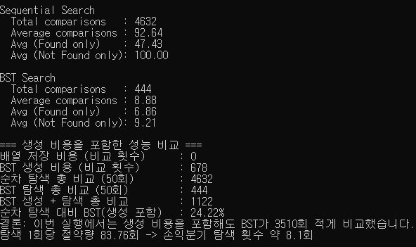

# 비교

실행 결과의 예시로는 다음과 같은 예시가 있다.

결과를 분석하였을때, 순차 탐색의 총 및 평균 비교 횟수는 각각 4632회와 92.64회(최종 일치시 47.43회, 불일치시 100회)임을 알 수 있다.

이진 탐색 트리 탐색의 총 및 평균 비교 횟수는 각각 444회와 8.88회(최종 일치시 6.86회, 불일치시 9.21회)임을 알 수 있다.

또한, BST(이진 탐색 트리)를 생성하는 데에 발생한 비교 횟수는 678회이며, 총 비교 횟수와 합산하면 1,122회 비교를 시도하였음을 알 수 있다.

BST 탐색의 총 비교 횟수는 순차 탐색에 비해 4,188회 적고, 약 9.585%(444/4632)의 비율을 가졌다.

BST의 생성에 사용한 비교 횟수를 포함한다면, 3,510회 적고, 약 24.222%(1122/4632)의 비율을 가졌다.

이외에, 평균 비교 횟수는 BST 탐색이 순차 탐색보다 83.76회 적어 그 만큼의 성능 차이를 낸다.

# 분석

순차 탐색은 배열로 구현되어 무작위 생성된 100개의 숫자를 배열에 바로 넣고, 이후 무작위 생성된 50개의 숫자를 인덱스 0부터 하나하나 비교해가며 탐색을 한다.

그러나, BST는 연결 자료구조를 사용하여 왼쪽 자식노드는 부모보다 작음, 오른쪽 자식노드는 부모보다 큰것을 전제로 생성하게 된다.

그 결과, BST 탐색은 모든 노드를 비교할 필요 없어 순차 탐색보다 비교 횟수가 현저하게 줄어들게 되고, 이것이 성능 차이를 불러 일으키게 된다.

BST를 생성하는 데에 필요한 비교 횟수를 포함하여도 비교 횟수는 순차 탐색의 비교 횟수보다 적어, 성능의 차이는 변하지 않는다.

## BST 구조에 따른 성능 차이

만약 BST의 구조가 위에서 설정한 노드 500개의 완전 이진트리라면, 비교 횟수는 최소 1회(루트) ~ 최대 9회(가장 아래쪽 노드)가 발생한다.

그러나, BST의 구조가 노드 500개의 편향 이진트리라면, 비교횟수는 최소 1회 ~ 최대 500회가 발생한다.

각 구조에서 최대-최대 비교가 발생했다면 491회, 최소-최대 비교가 발생했다면 499회의 비교 횟수 차이가 나타난다.

그렇기에, BST의 구조는 높이가 낮을수록 탐색중 비교 횟수가 적고, 탐색의 성능이 더 좋다고 볼 수 있다.